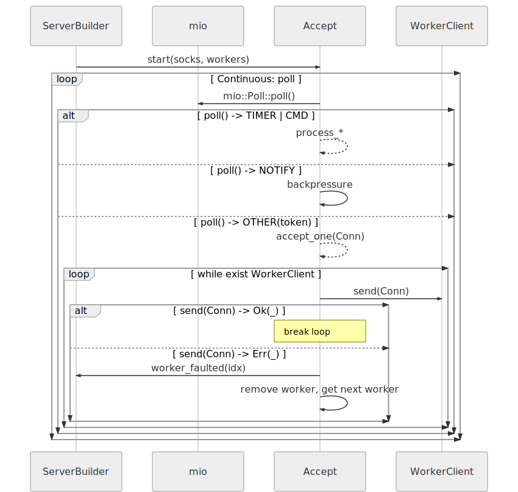
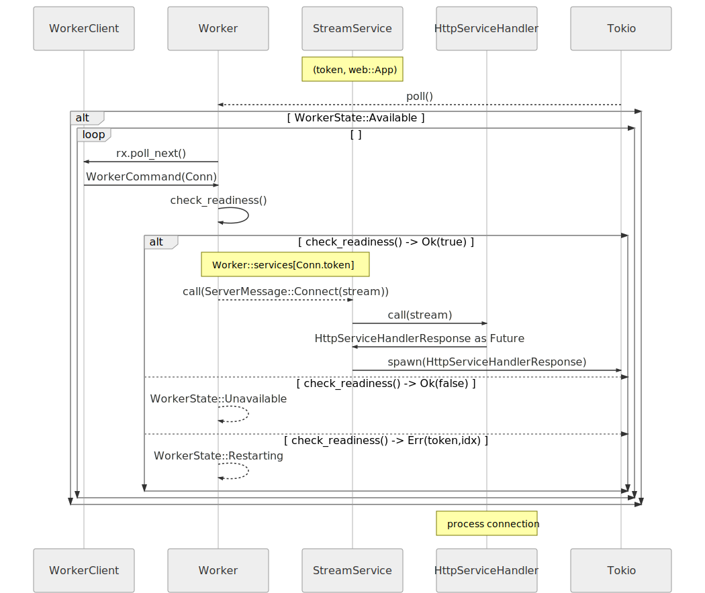
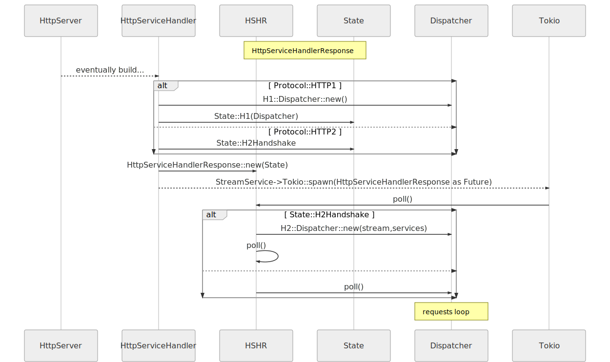

# 链接生命周期(Connection Lifecycle)

## 架构总览(Architecture overview)
在服务启动并监听所有socket链接后, `Accept` 和 `Worker` 两个主要的轮循是来处理从客户端传入的链接的.

一旦接受链接, 应用程序级协议处理就会从 `Worker` 派生(spawn)的指定 `Dispatcher` 循环中发生.

## Accept循环的更多细节 (Accept loop in more detail)

关于更多 [Accept](https://github.com/actix/actix-net/blob/master/actix-server/src/accept.rs) 结构体
代码的实现, 请参考 [actix-server](https://crates.io/crates/actix-server) 包.

## Worker循环的更多细节(Worker loop in more detail)

关于更多 [Worker](https://github.com/actix/actix-net/blob/master/actix-server/src/worker.rs) 结构体
代码的实现, 请参考 [actix-server](https://crates.io/crates/actix-server) 包.

## 请求循环大体过程(Request loop roughly)

更多请求循环的代码实现请参考 [actix-web](https://crates.io/crates/actix-web) 与 [actix-http](https://crates.io/crates/actix-http)
这两个包.