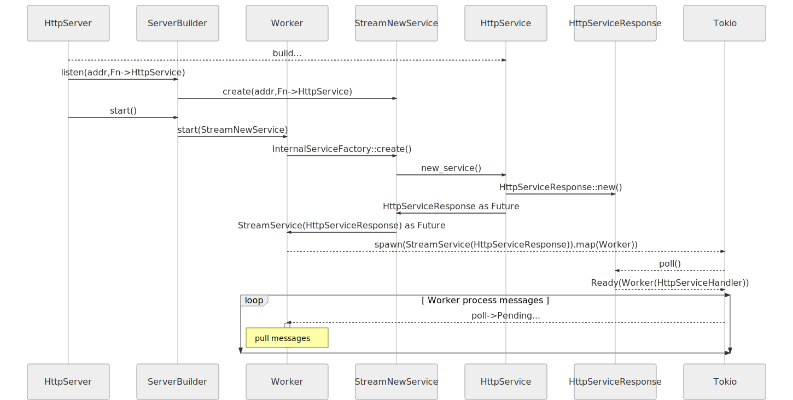

## 架构总览(Architecture overview)
下面的图表是 HttpServer 初始化过程, 它发生在如下代码处理过程中:

```rust
#[actix_web::main]
async fn main() -> std::io::Result<()> {
    HttpServer::new(|| {
        App::new()
            .route("/", web::to(|| HttpResponse::Ok()))
    })
    .bind("127.0.0.1:8080")?
    .run()
    .await
}
```

